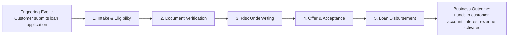

# Value Stream Architecture

Value Stream Architecture models how an organization delivers measurable value to customers and external stakeholders through an end-to-end series of sequential stages.

---

## 1. The Anatomy of a Value Stream

---

## 2. Directory Contents

* **[value-stream-mapping-principles.md](value-stream-mapping-principles.md)**: Value stages, triggers, stakeholders, and outcome metrics.
* **[customer-journeys-to-value-streams.md](customer-journeys-to-value-streams.md)**: Bridging customer-facing UX touchpoints with back-office enterprise value streams.
* **[identifying-architectural-gaps.md](identifying-architectural-gaps.md)**: Detecting handoff friction, latency bottlenecks, and manual data re-entry across stages.
* **[value-stream-enablement.md](value-stream-enablement.md)**: Mapping capabilities, applications, and technology platforms to value stream stages.
