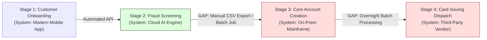

# Identifying Architectural Gaps Across Value Streams

How Enterprise Architects analyze value streams to expose systemic latency, manual swivel-chair operations, and data synchronization failures.

---

## 1. Architectural Gap Analysis Diagram

---

## 2. The 4 Fatal Value Stream Architectural Anti-Patterns

1. **The Swivel-Chair Gap**: A human operator manually re-keys data from one application's UI into another due to missing API integration.
   * *Architectural Fix*: Deploy an event-driven integration or API gateway contract.
2. **The Batch-Night Trap**: Real-time customer experience at Stage 1 gets trapped behind an overnight batch file transfer at Stage 3, destroying instant customer onboarding SLAs.
   * *Architectural Fix*: Implement Change Data Capture (CDC) via Kafka Debezium to stream updates in real-time.
3. **The Disconnected Data Silo**: Stage 2 modifies customer address, but Stage 4 ships the physical card to the old address because data is not synchronized.
   * *Architectural Fix*: Establish an enterprise Customer MDM (Master Data Management) product.
4. **The Unmonitored Black Hole**: Zero distributed tracing across value stream stages; when a transaction fails between Stage 2 and 3, customer service has no visibility.
   * *Architectural Fix*: Mandate OpenTelemetry trace context propagation across all stage boundaries.
