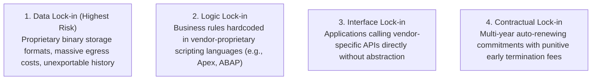
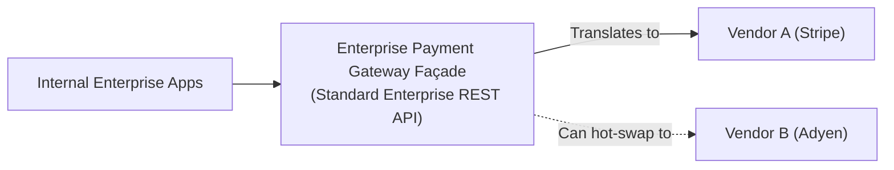

# Vendor Lock-In & Exit Strategies

Architectural design patterns to prevent multi-million dollar vendor entrapment.

---

## 1. The 4 Layers of Vendor Lock-In

---

## 2. The Architectural Exit Pattern: The Vendor Façade
Never allow downstream applications to import vendor SDKs or call vendor APIs directly. Always wrap third-party vendors behind an enterprise **Anti-Corruption Layer / Adapter**:

