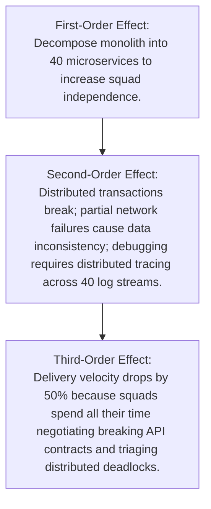

# Decision Quality & Architectural Intuition

Good architectural intuition is not magical inspiration; it is pattern recognition refined through years of observing system failures, evaluating trade-offs, and reasoning from first principles.

---

## 1. The 4 Cognitive Tools of Master Architects

### 1. First-Principles Thinking
Strip away vendor marketing, industry buzzwords, and conventional wisdom down to fundamental physics and computing realities:
* *Buzzword Claim*: "Our serverless architecture eliminates all latency and scaling limits."
* *First-Principles Reality*: Code still runs on physical silicon in a physical datacenter. Cold starts require container initialization and TLS handshakes over speed-of-light limited fiber optic networks. State must be stored somewhere.

### 2. Second-Order Thinking
Ask: *"And then what?"*

### 3. Reversibility (One-Way vs Two-Way Doors)
* **Two-Way Door Decisions**: Easily reversed with low cost (e.g., choosing a caching library, tweaking an HTTP timeout, selecting a JSON serializer). $	o$ **Make rapidly with minimal bureaucracy.**
* **One-Way Door Decisions**: Nearly impossible or prohibitively expensive to reverse (e.g., choosing a primary cloud provider, selecting a core database engine, signing a 5-year ERP contract). $	o$ **Analyze exhaustively, prototype, and peer-review.**

### 4. Preservation of Optionality
An architecture that preserves choices is inherently superior to one that locks the enterprise into a specific technology or topology. Use modular boundaries and open standards to keep your options open.
