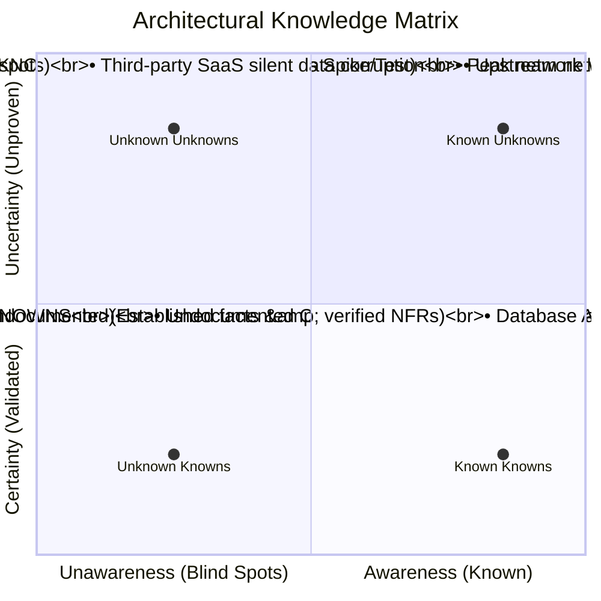

# Managing Knowns, Unknowns, and Unknown Unknowns

The master architect systematically surfaces hidden assumptions and blind spots before they manifest as production catastrophes.

---

## 1. The Architectural Epistemology Matrix

---

## 2. Exercises for Surfacing Unknown Unknowns

1. **The Pre-Mortem Simulation**:
   * Gather the team and state: *"It is 3 years from today. Our newly launched platform has suffered a catastrophic, unrecoverable failure and our stock dropped 15%. Write down exactly what caused the disaster."*
2. **Chaos & Failure Injection Hypotheses**:
   * Systematically ask: *"What happens if this network link drops packets? What happens if this queue fills up? What happens if this API returns HTTP 200 with an empty body?"*
3. **Cross-Disciplinary Red Teaming**:
   * Invite a senior SRE and a security penetration tester to review the architecture with the explicit mandate: *"Break this design."*
