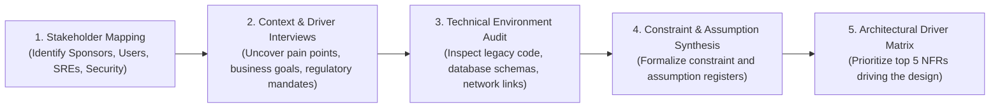

# Architecture Discovery Methodology

Architecture discovery is the structured process of transforming ambiguous stakeholder wishes into clear architectural drivers.

---

## 1. The 5-Stage Discovery Workflow

---

## 2. The 3 Types of Discovery

1. **Business Discovery**: Revenue models, customer personas, value streams, compliance obligations.
2. **Technical Discovery**: Existing codebases, database dependencies, network topology, cloud landing zones, deployment pipelines.
3. **Organizational Discovery**: Team structures, skill profiles, operational maturity, release frequency, political incentives.
