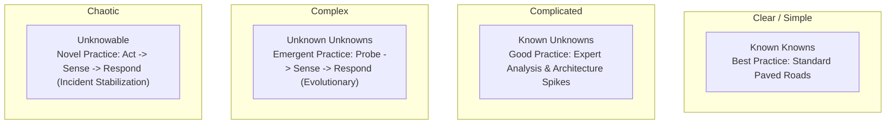

# Architecture Under Uncertainty & Incomplete Information

Senior architects rarely have perfect information, complete requirements, or unlimited time. Architecture mastery is the art of making sound, defensible decisions in the fog of business uncertainty.

---

## 1. The Cynefin Framework for Architects

---

## 2. Tactical Rules for Operating in Uncertainty

1. **Defer Irreversible Decisions to the Last Responsible Moment**:
   * Do not commit to a complex sharded database architecture before production traffic patterns reveal whether reads or writes dominate.
2. **Maximize Optionality via Clean Interface Contracts**:
   * Wrap uncertain third-party APIs or emerging databases behind an Anti-Corruption Layer (ACL). If the vendor fails or requirements pivot, swap the adapter without rewriting core business logic.
3. **Explicitly Document Assumptions in ADRs**:
   * Never hide assumptions. Write: *"We assume peak concurrent users will not exceed 20,000 in Year 1 based on marketing forecasts. If concurrent users exceed 50,000, this single-instance PostgreSQL database must be migrated to a distributed database."*
4. **Use Architecture Spikes and PoCs to Buy Information**:
   * When faced with a critical unknown (e.g., "Can this vector database handle 10,000 QPS with sub-20ms latency?"), spend 3 days running a targeted benchmark rather than 3 weeks debating it in meetings.
