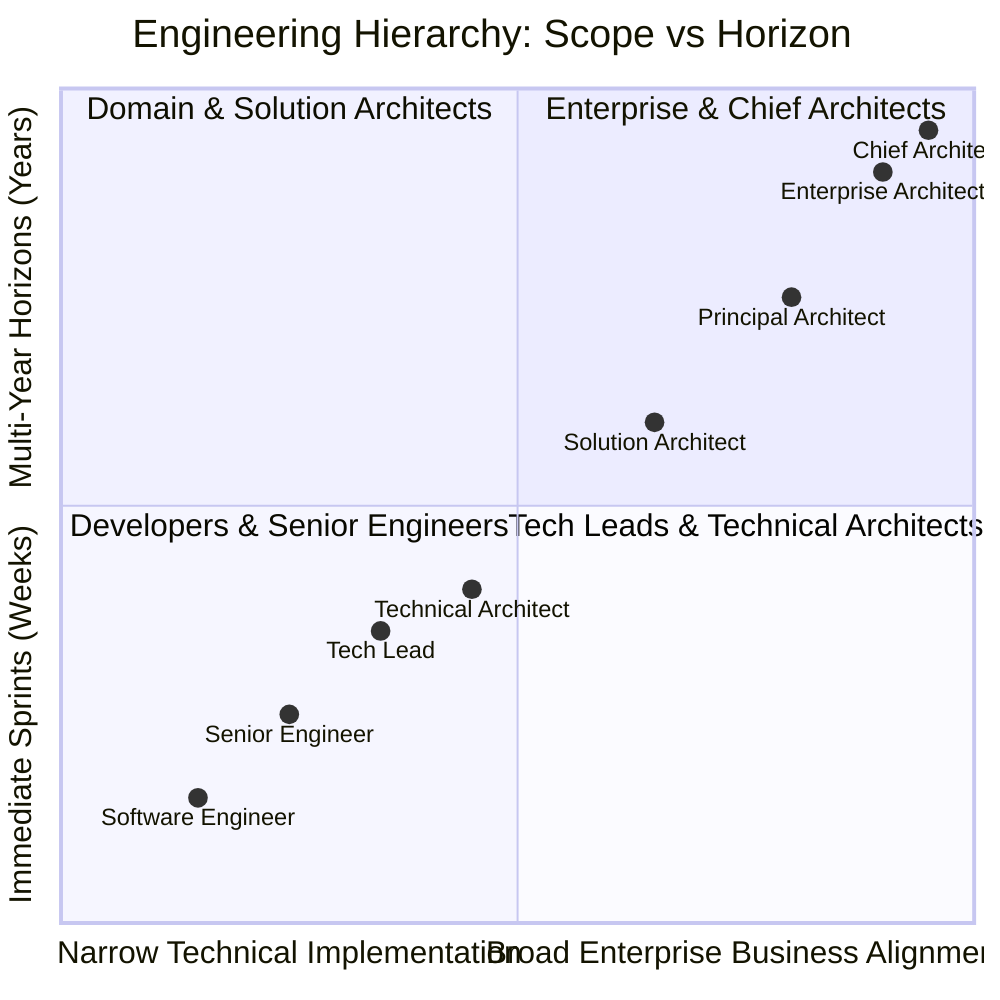

# Developer to Enterprise Architect Evolution

Architecture is not simply "the next level of senior software development." It is a fundamental shift in cognitive scope, time horizon, and accountability.

---

## 1. The Architectural Scope Evolution

---

## 2. The Mental Model Shift Across Roles

| Dimension | Senior Software Engineer | Technical / Solution Architect | Enterprise / Chief Architect |
| :--- | :--- | :--- | :--- |
| **Primary Output** | Working, tested, maintainable code and pull requests. | System designs, C4 diagrams, interface contracts, and ADRs. | Enterprise target architectures, technology standards, capability maps, and capital advice. |
| **Success Metric** | Clean code, high test coverage, rapid sprint story completion. | System reliability, scalability, security, and delivery velocity of squads. | Alignment of IT spend with corporate strategy, portfolio TCO reduction, risk containment. |
| **Time Horizon** | Current Sprint to 1 Quarter. | 6 Months to 18 Months. | 2 Years to 5 Years. |
| **Primary Stakeholder** | Tech Lead, Peers, Product Owner. | Engineering Managers, Product Managers, Security Leads. | CIO, CTO, CFO, CISO, VPs of Business Units, Board. |
| **Response to Failure** | "Let me debug this stack trace and fix the null pointer." | "Why was this failure not contained by a bulkhead or circuit breaker?" | "Why did our governance and testing fitness functions fail to detect this architectural fragility?" |
