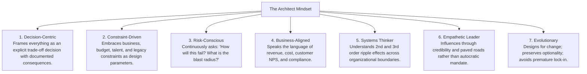

# What Makes a Great Architect

Great architects are not defined by how many technologies they know, but by the clarity of their judgment, the rigor of their trade-off analysis, and their ability to influence organizations to build sustainable systems.

---

## 1. The 7 Pillars of the Architect Mindset

---

## 2. Core Operational Truths

1. **There are no solutions, only trade-offs**: Every architectural pattern has a dark side. Microservices trade binary simplicity for network latency and operational complexity; monoliths trade deployment independence for coupling.
2. **The best architecture is the simplest one that satisfies actual constraints**: Over-engineering is an architectural vice. Adding unneeded distributed infrastructure is not sophistication—it is amateurism.
3. **Software reflects communication structures (Conway's Law)**: If you design a software architecture that conflicts with how your teams communicate, the architecture will inevitably lose.
4. **Code is temporary; boundaries and contracts are permanent**: Implementation languages and frameworks will be replaced every 3–5 years; domain boundaries, data schemas, and API contracts endure for decades.
