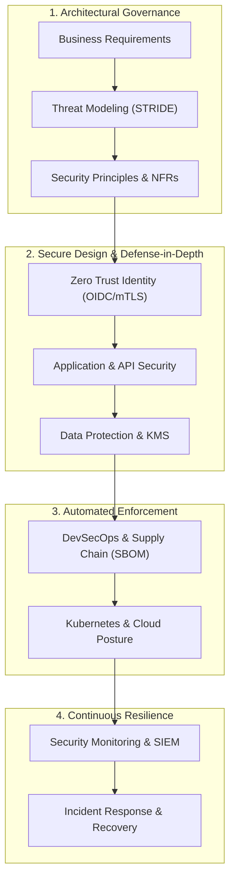

# Security & Operations Architecture (`10-security/`)

## Executive Summary

The `10-security/` domain establishes the authoritative architectural blueprint for securing enterprise platforms across Fortune 500, financial institutions, healthcare, SaaS, and government environments.

Rather than approaching security as an isolated set of operational tools, compliance checklists, or perimeter firewalls, this reference treats security as an **end-to-end architectural dimension** woven into every layer of systems engineering: from business requirements and threat modeling to identity, authorization, zero trust, cryptography, supply chains, and incident response.

---

## Domain Taxonomy & Structure

| Directory | Domain Focus | Primary Architectural Decisions |
| :--- | :--- | :--- |
| [`security-principles.md`](security-principles.md) | Architectural Principles | 15 Non-negotiable enterprise security tenets |
| [`security-maturity-model.md`](security-maturity-model.md) | Organizational Maturity | Level 1 (Reactive) through Level 5 (Continuous Resilience) |
| [`security-architecture/`](security-architecture/) | Core Security Architecture | Defense in depth, least privilege, blast radius, fail secure |
| [`enterprise-security/`](enterprise-security/) | Enterprise Governance | Security operating models, policies, ARB review, risk acceptance |
| [`threat-modeling/`](threat-modeling/) | Threat Modeling & STRIDE | Systematic discovery, attack trees, trust boundaries, templates |
| [`identity/`](identity/) | Identity Architecture | Human, workload, and machine identity, SCIM lifecycle, PIM |
| [`authentication/`](authentication/) | Authentication Systems | Passwordless, FIDO2, MFA, adaptive risk scoring, revocation |
| [`authorization/`](authorization/) | Authorization Paradigms | RBAC, ABAC, ReBAC, Policy-as-Code (OPA, Cedar) |
| [`oauth2/`](oauth2/) | OAuth 2.0 Framework | Auth Code + PKCE, client credentials, token issuance & scopes |
| [`oidc/`](oidc/) | OpenID Connect | ID tokens, claims, UserInfo, discovery, enterprise SSO |
| [`jwt/`](jwt/) | JSON Web Tokens | Structure, validation, rotation, stateless vs stateful trade-offs |
| [`sso/`](sso/) & [`federation/`](federation/) | Single Sign-On | Enterprise SAML/OIDC federation, B2B/B2C identity topologies |
| [`zero-trust/`](zero-trust/) | Zero Trust Architecture | Identity perimeter, device posture, microsegmentation |
| [`api-security/`](api-security/) | API Protection | mTLS, rate limiting, token validation, replay mitigation |
| [`application-security/`](application-security/) | AppSec & OWASP | Injection, broken auth, SSRF, memory safety, logic flaws |
| [`frontend-security/`](frontend-security/) | Web Client Security | CSP, SameSite cookies, SPA token storage, clickjacking |
| [`mobile-security/`](mobile-security/) | Mobile Protection | Secure Enclave/KeyStore, cert pinning, offline safety |
| [`cloud-security/`](cloud-security/) | Cloud Security | Shared responsibility, IAM guardrails, CSPM, VPC controls |
| [`network-security/`](network-security/) | Network Defenses | WAF, DDoS mitigation, egress inspection, PrivateLink |
| [`container-security/`](container-security/) | Container Hardening | Minimal base images, rootless execution, image signing |
| [`kubernetes-security/`](kubernetes-security/) | K8s Platform Security | RBAC, Pod Security Standards (`restricted`), Cilium eBPF |
| [`infrastructure-security/`](infrastructure-security/) | Infrastructure Baselines | CIS benchmarks, OS hardening, immutable IaC scanning |
| [`data-security/`](data-security/) | Data Protection | Classification, tokenization, masking, DLP, retention |
| [`encryption/`](encryption/) | Cryptography | Symmetric/asymmetric ciphers, TLS 1.3, envelope encryption |
| [`key-management/`](key-management/) | Key Management | KMS vs Cloud HSM, key hierarchies, automated rotation |
| [`secrets-management/`](secrets-management/) | Secrets Governance | Dynamic secrets, HashiCorp Vault, External Secrets Operator |
| [`secure-development/`](secure-development/) | Secure SDLC | Shift-left testing, SAST, DAST, SCA, threat review gates |
| [`devsecops/`](devsecops/) | Pipeline Security | CI/CD automated gates, artifact signing, policy enforcement |
| [`supply-chain-security/`](supply-chain-security/) | Software Supply Chain | SBOM (CycloneDX), SLSA Level 3 provenance, Cosign signing |
| [`vulnerability-management/`](vulnerability-management/) | Vulnerability Ops | EPSS risk scoring, CVE prioritization, compensating controls |
| [`security-monitoring/`](security-monitoring/) | Detection & SIEM | Audit logging, event correlation, behavioral anomaly detection |
| [`incident-response/`](incident-response/) | Incident Response | Preparation, containment, eradication, ransomware runbooks |
| [`compliance/`](compliance/) | Regulatory Architecture | GDPR, PCI-DSS 4.0, HIPAA, SOC 2, ISO 27001 mapping |
| [`privacy/`](privacy/) | Privacy Engineering | Privacy-by-Design, data minimization, right to be forgotten |
| [`governance/`](governance/) | Governance Framework | Security KPIs, metrics, control attestation, audit evidence |
| [`security-patterns/`](security-patterns/) | Architecture Patterns | 17 Production security design patterns with full specs |
| [`security-anti-patterns/`](security-anti-patterns/) | Anti-Patterns | 20 Lethal security design antipatterns and refactoring |
| [`decision-frameworks/`](decision-frameworks/) | Decision Frameworks | 16 Formal decision scorecards for security dilemmas |
| [`checklists/`](checklists/) | Operational Checklists | ARB evaluation gates and audit readiness checklists |
