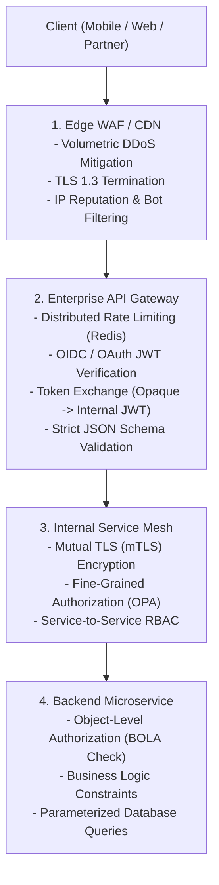

# API Security Architecture: Edge to Core

## Executive Summary

Securing enterprise APIs requires a multi-tier defense where responsibilities are cleanly divided between Edge Gateways, Central API Gateways, and Internal Microservices.

---

## 1. Multi-Tier API Defense Architecture

