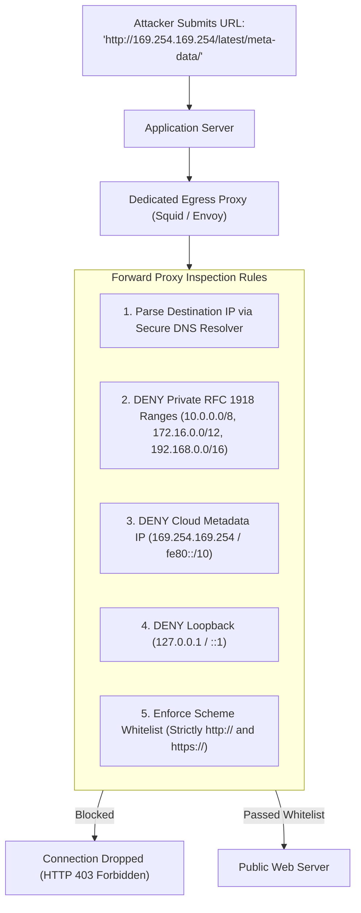

# Server-Side Request Forgery (SSRF) Defense Architecture

## Executive Summary

SSRF occurs when a backend server fetches a remote resource (e.g., importing an avatar image, rendering a PDF from URL, or sending a webhook) using an attacker-controlled URL, allowing the attacker to access internal private networks or cloud metadata.

---

## 1. Multi-Layered SSRF Defense Architecture

### Additional Infrastructure Hardening:
- **Mandate AWS IMDSv2**: Enforce `HttpTokens=required` and `HttpPutResponseHopLimit=1` on all EC2 instances, preventing containers from reaching the metadata service.
