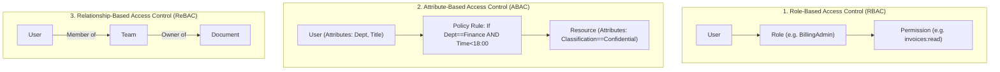

# Authorization Paradigms (RBAC vs ABAC vs ReBAC vs PBAC)

## Executive Summary

Choosing the correct authorization paradigm is a foundational architectural decision that impacts database design, cacheability, API latency, and organizational scalability.

---

## 1. Paradigm Comparison

---

## 2. Multi-Dimensional Comparison Matrix

| Dimension | RBAC | ABAC | ReBAC (Zanzibar) | PBAC (Policy-as-Code) |
| :--- | :--- | :--- | :--- | :--- |
| **Model Concept** | User $\rightarrow$ Roles $\rightarrow$ Permissions | Policies over subject/resource attributes | Graph traversal over object relationships | Decoupled declarative policy engine (OPA) |
| **Complexity** | Low | High | High | Moderate |
| **Granularity** | Coarse | Extreme | Fine (Hierarchical) | Fine |
| **Latency Overhead** | Sub-millisecond (Bitmap check) | 2–10 ms (Attribute retrieval) | 5–25 ms (Graph query) | 1–5 ms (In-memory Rego evaluation) |
| **Role Explosion Risk**| **Severe** (Thousands of ad-hoc roles) | None | None | None |
| **Recommended Use** | Simple enterprise apps with fixed roles | Highly regulated systems with contextual rules | Collaborative SaaS tools (Google Drive, Notion) | Microservices, Kubernetes, Cloud IAM |
