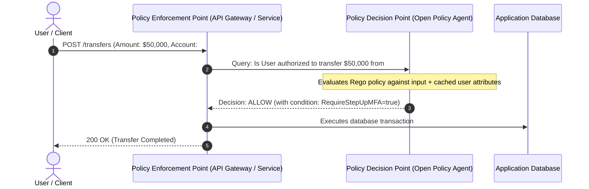

# Fine-Grained Authorization (FGA) & Policy as Code

## Executive Summary

Hardcoding authorization logic (`if user.role == 'admin'`) inside microservice application code violates the Single Responsibility Principle, creates massive maintenance debt, and makes compliance auditing impossible. 

**Policy as Code (PaC)** decouples authorization decisions from business logic into centralized, version-controlled policy engines.

---

## 1. Decoupled Authorization Architecture



---

## 2. Open Policy Agent (OPA) Example Policy (Rego)

```rego
package banking.transfers

default allow = false

# Allow transfer if user is the account owner and transfer is under daily limit
allow {
    input.action == "transfer"
    input.user.id == input.resource.account_owner_id
    input.amount <= 10000
}

# Require dual approval if transfer exceeds $10,000
allow {
    input.action == "transfer"
    input.amount > 10000
    input.approvals.count >= 2
    not input.user.id in input.approvals.user_ids  # Cannot approve own transfer
}
```
