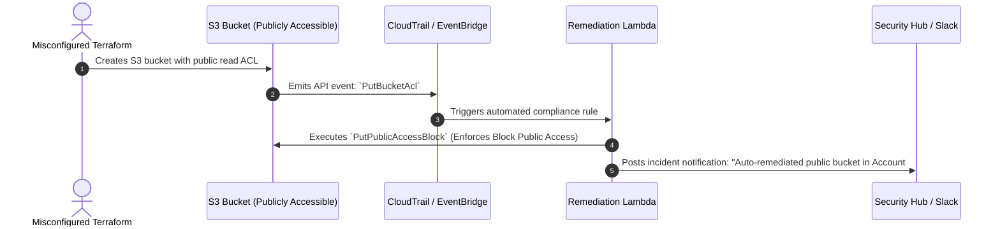

# Cloud Security Posture Management (CSPM) & Automated Remediation

## Executive Summary

CSPM provides continuous, agentless visibility into multi-cloud infrastructure, detecting misconfigurations (e.g., publicly readable S3 buckets, open security groups) against CIS benchmarks.

---

## Event-Driven Automated Remediation Architecture

