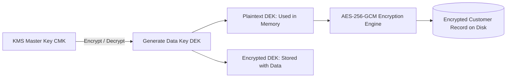

# Data Security: Encryption at Rest & Envelope Encryption Architecture

## 1. Architectural Purpose & Problem Context
KMS-managed Customer Master Keys (CMK), generating Data Encryption Keys (DEK), AES-256-GCM, and automated annual key rotation.

---

## 2. Envelope Encryption Architecture

---

## 3. Production Invariants
- Production databases containing PII, financial, or healthcare data must enforce AES-256 encryption at rest and TLS 1.3 in transit.
- Non-production environments must never store unmasked production PII or cardholder data.
