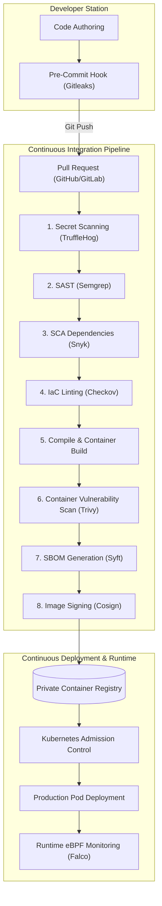

# Enterprise DevSecOps Pipeline Architecture

## Executive Summary

```mermaid
flowchart TD
    subgraph Dev ["Developer Station"]
        Code["Code Authoring"] --> PreCommit["Pre-Commit Hook (Gitleaks)"]
    end
    PreCommit -->|Git Push| PR["Pull Request (GitHub/GitLab)"]

    subgraph CI ["Continuous Integration Pipeline"]
        PR --> S1["1. Secret Scanning (TruffleHog)"]
        S1 --> S2["2. SAST (Semgrep)"]
        S2 --> S3["3. SCA Dependencies (Snyk)"]
        S3 --> S4["4. IaC Linting (Checkov)"]
        S4 --> Build["5. Compile & Container Build"]
        Build --> S5["6. Container Vulnerability Scan (Trivy)"]
        S5 --> S6["7. SBOM Generation (Syft)"]
        S6 --> S7["8. Image Signing (Cosign)"]
    end

    S7 --> Registry[("Private Container Registry")]

    subgraph CD ["Continuous Deployment & Runtime"]
        Registry --> Gatekeeper["Kubernetes Admission Control"]
        Gatekeeper --> Prod["Production Pod Deployment"]
        Prod --> Falco["Runtime eBPF Monitoring (Falco)"]
    end
```
