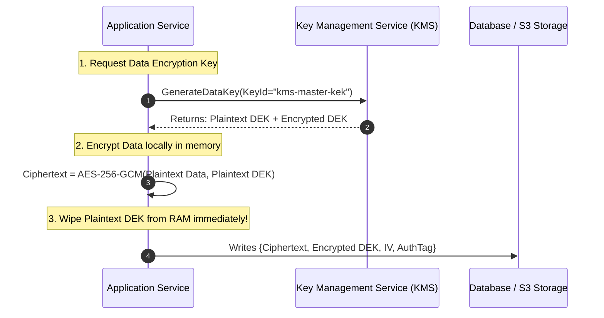

# Envelope Encryption Architecture

## Executive Summary

Encrypting large volumes of data directly using a central KMS key creates severe network bottlenecks and hits KMS API rate limits. **Envelope Encryption** solves this by encrypting data locally with an ephemeral Data Encryption Key (DEK).

---

## 1. Envelope Encryption Workflow

