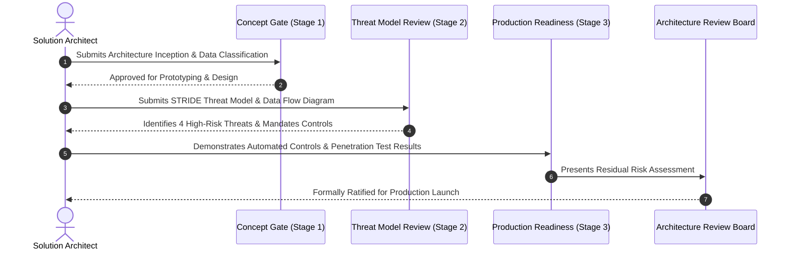

# ARB Security Review Gate Process

## Executive Summary

The Architecture Review Board (ARB) Security Gate ensures that no architecture proposal moves to production without systematic threat modeling, compliance validation, and risk sign-off.

---

## 1. Stage-Gate Workflow

