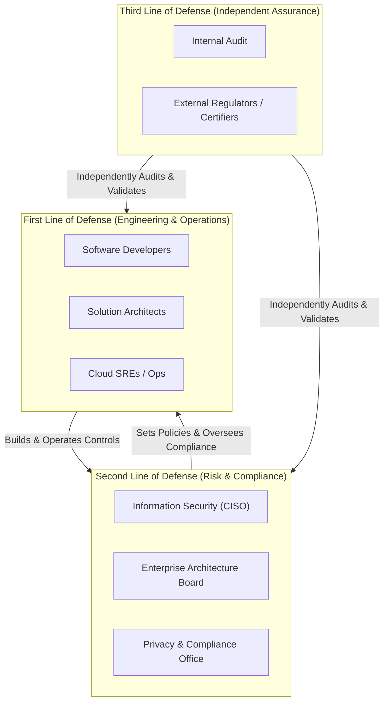

# Enterprise Security Governance Framework

## Executive Summary

Enterprise security governance establishes the organizational structure, authority lines, control objectives, and reporting mechanisms that ensure technical systems align with enterprise risk appetite.

---

## 1. The Three Lines of Defense Model

---

## 2. Key Responsibilities Across the Three Lines

1. **First Line (Engineering & Architecture)**:
   - Owns day-to-day risk management and control implementation.
   - Authors threat models, adheres to secure coding standards, and remediates vulnerabilities within SLA.
2. **Second Line (Security & Governance)**:
   - Establishes enterprise security standards, policies, and control baselines.
   - Operates centralized detection tooling (SIEM), conducts ARB architecture security reviews, and governs risk acceptance.
3. **Third Line (Internal Audit)**:
   - Provides objective, board-level assurance that First and Second Line controls are operating effectively.
