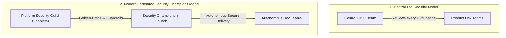

# Security Operating Models (Centralized vs Federated)

## Executive Summary

The Security Operating Model determines how security expertise, decision authority, and operational execution are distributed across the organization.

---

## 1. Operating Model Comparison

---

## 2. Architectural Comparison Matrix

| Dimension | Centralized Security ("Gatekeeper") | Federated / Security Champions ("Enabler") |
| :--- | :--- | :--- |
| **Delivery Speed** | Bottlenecked (Teams wait weeks for security review) | High (Security baked into automated CI/CD Golden Paths) |
| **Security Coverage** | Spotty (Engineers circumvent security review to hit deadlines) | Pervasive (Trained security champions embedded in every squad) |
| **Scale Feasibility** | Fails above 500 engineers (Security cannot hire fast enough) | Scales to 10,000+ engineers with a 1:10 Champion-to-Dev ratio |
| **ARB Engagement** | Reviews every low-level configuration change | Focuses on high-impact Tier-1 architectures and threat models |
