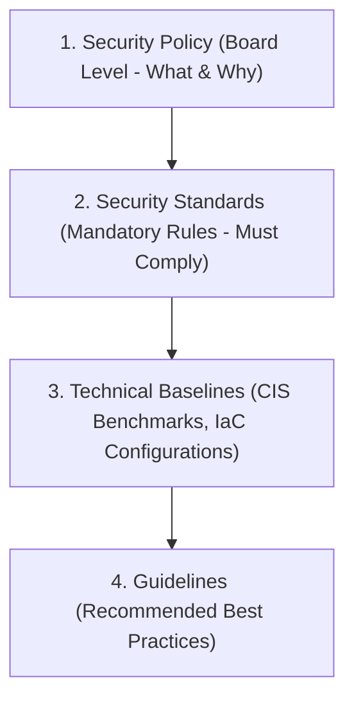

# Security Policies, Standards, Baselines, and Guidelines

## Executive Summary

Enterprise security directives must be organized into a strict hierarchical taxonomy to prevent ambiguity and ensure clear enforceability.

---

## 1. Directive Hierarchy

1. **Policy (Mandatory)**: Executive statements of intent signed by the CISO/Board (e.g., "All sensitive customer data must be protected against unauthorized disclosure").
2. **Standards (Mandatory)**: Measurable technical constraints (e.g., "All data in transit across public networks must use TLS 1.3 with approved cipher suites").
3. **Baselines (Mandatory)**: Codified configuration manifests (e.g., CIS AWS Benchmark Level 2 Terraform module).
4. **Guidelines (Discretionary)**: Advice on implementation strategies and framework selections.
