# Identity Federation Patterns (B2E vs B2B vs B2C)

## Executive Summary

Enterprise architectures handle three distinct identity federation patterns, each optimized for different scale, lifecycle, and regulatory requirements:

---

## 1. Federation Topology Comparison

```mermaid
flowchart TD
    subgraph B2E ["1. B2E (Workforce Identity)"]
        E1["Employee"] --> OKTA["Corporate Okta / Entra ID"]
        OKTA --> INTERNAL["Internal Enterprise Systems"]
    end
    subgraph B2B ["2. B2B (Partner / Vendor Federation)"]
        V1["Partner Vendor"] --> V_IDP["Vendor's Azure AD"]
        V_IDP -->|SAML / OIDC Federation| HUB["Enterprise Identity Broker"]
        HUB --> SAAS["Partner Portal"]
    end
    subgraph B2C ["3. B2C (Customer Identity & CIAM)"]
        C1["Consumer"] --> SOCIAL["Google / Apple / Passkeys"]
        SOCIAL --> CIAM["Customer IdP (Auth0 / AWS Cognito)"]
        CIAM --> COMMERCE["Public Digital Platform"]
    end
```

