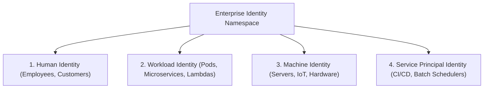

# Identity Architecture (Human vs Machine vs Workload)

## Executive Summary

Enterprise systems interact with four fundamentally distinct categories of identity, each requiring distinct credential formats, lifecycles, and authorization mechanisms.

---

## 1. The Four Classes of Identity

---

## 2. Comparative Matrix Across Identity Classes

| Dimension | Human Identity | Workload Identity | Machine Identity | Service Principal Identity |
| :--- | :--- | :--- | :--- | :--- |
| **Authentication Credential** | Passwordless FIDO2 / WebAuthn, MFA, OIDC JWT | Short-lived OIDC JWT, SPIFFE/SPIRE X.509 cert | TPM chip, hardware X.509 certificate | Asymmetric certificate, mTLS |
| **Credential Lifetime** | Session: 8–12 hours; Token: 15 mins | 15–60 minutes (auto-rotated) | 1–2 years (hardware-bound) | 90 days (automated rotation) |
| **Revocation Mechanism** | Central IdP session revocation, user deprovisioning | Pod termination, token expiration, CRL/OCSP | Certificate revocation list (CRL) | IdP app registration secret disablement |
| **Issuing Authority** | Okta / Microsoft Entra ID / Keycloak | Kubernetes OIDC Issuer, SPIRE, AWS IAM OIDC | Enterprise PKI (HashiCorp Vault / DigiCert) | Cloud IAM / Entra ID Enterprise App |
| **Risk of Compromise** | Phishing, credential stuffing, session hijacking | Container escape, SSRF against IMDS, memory dump | Physical theft, hardware side-channel | CI/CD script leakage in public Git repository |
