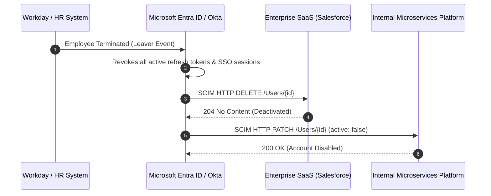

# Identity Lifecycle Management & SCIM 2.0

## Executive Summary

Identity Lifecycle Management (Joiners, Movers, Leavers) governs how digital identities are born, modified, and terminated. The greatest enterprise security vulnerability in identity is **orphaned accounts**—identities belonging to terminated employees or decommissioned services that retain active access.

---

## 1. Automated SCIM 2.0 Provisioning Architecture

