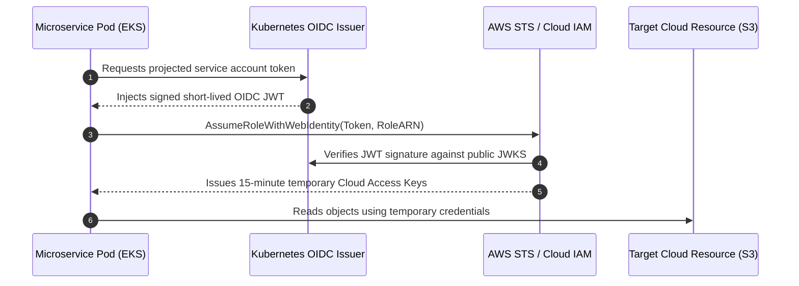

# Workload Identity Federation

## Executive Summary

Workload Identity Federation enables software running in Kubernetes, GitHub Actions, or on-premises datacenters to authenticate securely to cloud providers (AWS, Azure, GCP) **without storing long-lived API keys or credentials**.

---

## 1. Workload Identity Federation Architecture

