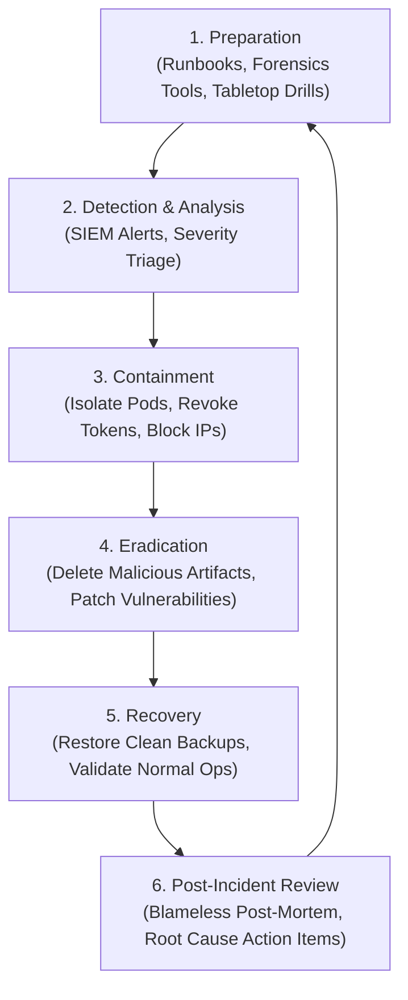

# NIST SP 800-61 Security Incident Response Lifecycle

## Executive Summary

```mermaid
flowchart TD
    S1["1. Preparation<br/>(Runbooks, Forensics Tools, Tabletop Drills)"] --> S2["2. Detection & Analysis<br/>(SIEM Alerts, Severity Triage)"]
    S2 --> S3["3. Containment<br/>(Isolate Pods, Revoke Tokens, Block IPs)"]
    S3 --> S4["4. Eradication<br/>(Delete Malicious Artifacts, Patch Vulnerabilities)"]
    S4 --> S5["5. Recovery<br/>(Restore Clean Backups, Validate Normal Ops)"]
    S5 --> S6["6. Post-Incident Review<br/>(Blameless Post-Mortem, Root Cause Action Items)"]
    S6 --> S1
```
