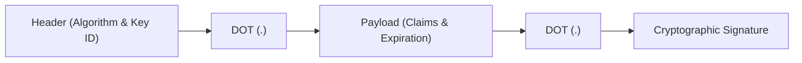

# JWT Architecture & Structure

## Executive Summary

A JSON Web Token consists of three parts separated by dots (`.`):
$$\text{JWT} = \text{Base64URL}(\text{Header}) \, . \, \text{Base64URL}(\text{Payload}) \, . \, \text{Base64URL}(\text{Signature})$$

---

## 1. Component Anatomy



1. **Header**: Contains metadata about the token format and cryptographic cipher:
   ```json
   {
     "alg": "RS256",
     "typ": "JWT",
     "kid": "auth-key-2026-q1"
   }
   ```
2. **Payload**: Contains the registered, public, and private claims:
   ```json
   {
     "iss": "https://auth.enterprise.com",
     "sub": "usr_01H8Z9C4B7W",
     "aud": "https://api.enterprise.com",
     "exp": 1772712000,
     "iat": 1772711100,
     "tenant_id": "cust_ten_994",
     "roles": ["BillingAdmin"]
   }
   ```
3. **Signature**: Computed by passing the encoded header and payload to the cryptographic algorithm using the issuer's private key:
   $$\text{Signature} = \text{Sign}_{K_{\text{private}}}(\text{Base64URL}(\text{Header}) + "." + \text{Base64URL}(\text{Payload}))$$
