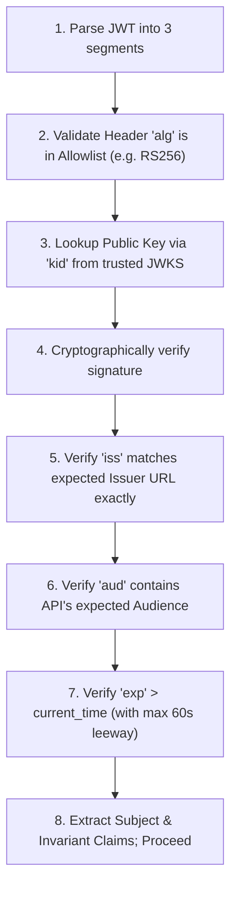

# Deterministic JWT Validation Algorithm

## Executive Summary

Every Resource Server must execute this exact 8-step algorithmic validation sequence before trusting any claim within a JWT.

---

```mermaid
flowchart TD
    S1["1. Parse JWT into 3 segments"] --> S2["2. Validate Header 'alg' is in Allowlist (e.g. RS256)"]
    S2 --> S3["3. Lookup Public Key via 'kid' from trusted JWKS"]
    S3 --> S4["4. Cryptographically verify signature"]
    S4 --> S5["5. Verify 'iss' matches expected Issuer URL exactly"]
    S5 --> S6["6. Verify 'aud' contains API's expected Audience"]
    S6 --> S7["7. Verify 'exp' > current_time (with max 60s leeway)"]
    S7 --> S8["8. Extract Subject & Invariant Claims; Proceed"]
```
