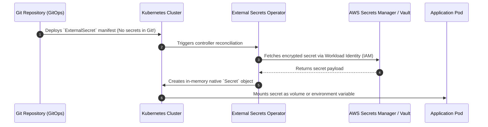

# Secrets Management in Kubernetes (External Secrets Operator)

## Executive Summary

Storing raw secrets in native Kubernetes `Secret` manifests committed to Git is a critical anti-pattern (Kubernetes secrets are merely Base64-encoded, not encrypted).

---

## 1. External Secrets Operator (ESO) Architecture

