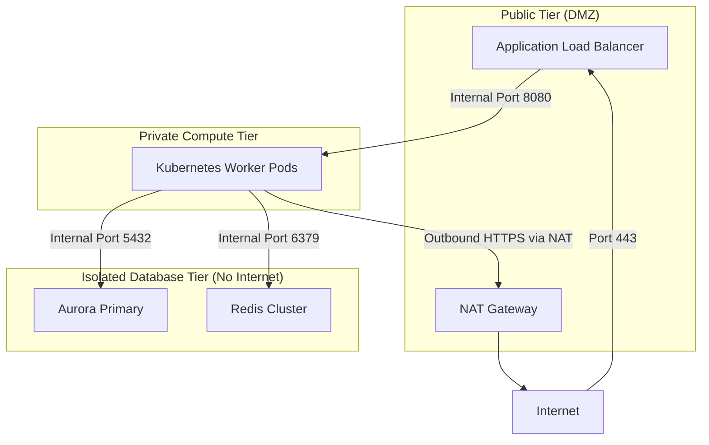

# Network Segmentation & Microsegmentation

## Executive Summary

Network segmentation partitions enterprise networks into isolated subnet tiers. Microsegmentation applies granular, workload-level firewall rules directly to virtual interfaces or container network namespaces.

---

## 1. Subnet Tiering Architecture

