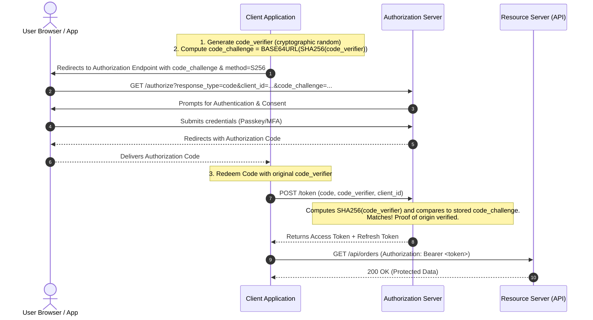

# Authorization Code Flow with PKCE (RFC 7636)

## Executive Summary

Proof Key for Code Exchange (PKCE, pronounced "pixy") was originally designed for mobile native apps to prevent Authorization Code interception attacks. Today, OAuth 2.1 mandates PKCE for **ALL client applications**, including server-side confidential web apps and Single Page Applications (SPAs).

---

## 1. Protocol Sequence Diagram

---

## 2. Cryptographic Construction
- **Code Verifier**: A cryptographically random string using the unreserved characters `[A-Z]`, `[a-z]`, `[0-9]`, `-`, `.`, `_`, `~`, with a minimum length of 43 characters and a maximum length of 128 characters.
- **Code Challenge**:
  $$\text{code\_challenge} = \text{BASE64URL-ENCODE}(\text{SHA-256}(\text{code\_verifier}))$$
  The `code_challenge_method` must strictly be set to `S256`. The legacy `plain` method is strictly prohibited by enterprise security standards.
