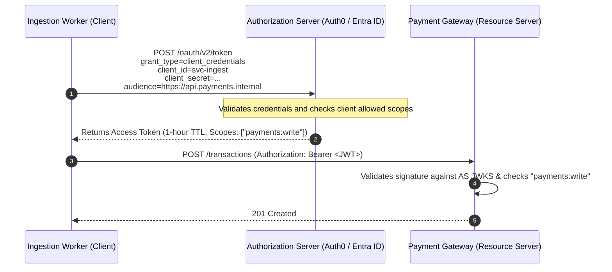

# Client Credentials Flow (Machine-to-Machine)

## Executive Summary

The Client Credentials flow is used strictly for Machine-to-Machine (M2M) communication where there is no human user involved (e.g., automated cron jobs, daemon workers, or backend microservices communicating with another service).

---

## 1. Flow Sequence

---

## 2. Hardening Client Credentials
1. **Asymmetric Private Key JWT (RFC 7523)**: Replace shared static `client_secret` strings with asymmetric private key signing. The client signs an assertion JWT using its private RSA/ECDSA key; the Authorization Server validates it against the client's registered public key.
2. **Mutual TLS (mTLS) Client Authentication (RFC 8705)**: The client authenticates via a trusted X.509 certificate during the TLS handshake, binding the access token to the client's certificate to prevent token theft and replay.
