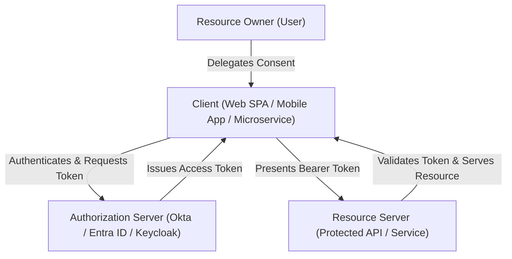

# OAuth 2.0 Architectural Roles & Topologies

## Executive Summary

OAuth 2.0 defines four distinct protocol roles. Understanding the separation of concerns between these roles is essential for designing decoupled, horizontally scalable identity and API platforms.

---

## 1. The Four Protocol Roles

1. **Resource Owner (RO)**: An entity capable of granting access to a protected resource (typically the end user).
2. **Client**: An application making protected resource requests on behalf of the resource owner. Categorized into **Confidential Clients** (can securely hold a secret, e.g., backend Node.js/Java server) and **Public Clients** (cannot maintain confidentiality, e.g., React SPA, native iOS app).
3. **Authorization Server (AS)**: The server issuing access tokens to the client after successfully authenticating the resource owner and obtaining authorization.
4. **Resource Server (RS)**: The server hosting the protected resources, capable of accepting and validating authorized access tokens.
