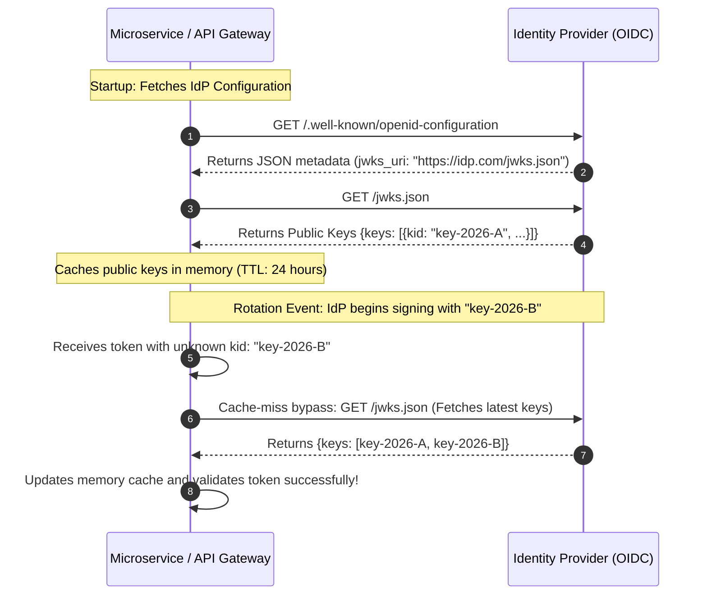

# OIDC Discovery & Automated JWKS Key Rolling

## Executive Summary

The OpenID Connect Discovery specification allows client applications to automatically configure endpoints, supported scopes, and cryptographic signing keys by querying a standardized discovery document:
`https://{issuer}/.well-known/openid-configuration`

---

## 1. Automated JWKS Key Rotation Architecture

