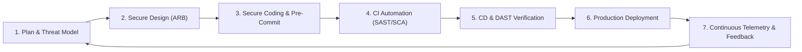

# Secure Software Development Lifecycle (SSDLC) Framework

## Executive Summary

Adhering to the NIST Secure Software Development Framework (SSDF SP 800-218) ensures that software security is built into the product rather than audited after release.

---

## 1. The 7-Phase Secure Lifecycle

| Phase | Security Activities | Non-Bypassable Exit Gate |
| :--- | :--- | :--- |
| **1. Plan** | Data classification, regulatory requirement mapping | Data sensitivity sign-off |
| **2. Design** | STRIDE threat modeling, trust boundary definition | Approved Threat Model in ARB |
| **3. Code** | IDE security linters, pre-commit secret scanning | Git commit hook passes |
| **4. Build (CI)** | SAST scanning, SCA dependency analysis, image linting | Zero Critical/High CVEs in PR |
| **5. Test (CD)** | DAST dynamic scanning, infrastructure policy checks | Automated staging gate passes |
| **6. Deploy** | Image signature verification (Cosign), SLSA provenance | Validated admission controller |
| **7. Operate** | SIEM monitoring, vulnerability patching, chaos drills | Real-time security telemetry active |
