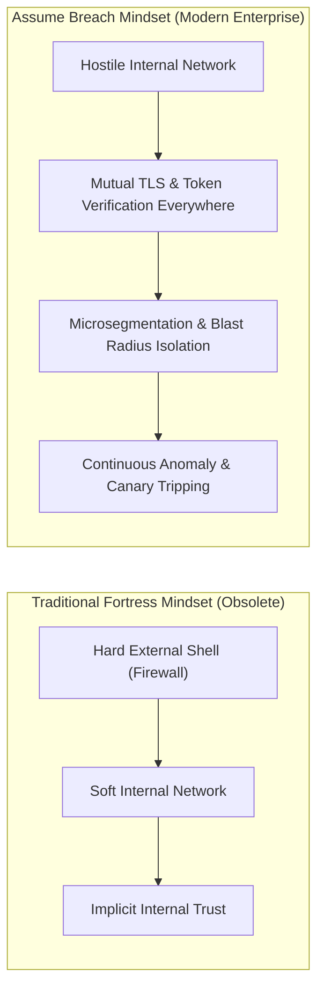

# Assume Breach Architecture

## Executive Summary

The **Assume Breach** architectural posture acknowledges that modern enterprises cannot guarantee 100% perimeter invulnerability. Sophisticated threat actors, insider threats, stolen developer credentials, and zero-day dependency vulnerabilities will eventually penetrate external defenses.

Therefore, the system architecture must be designed to **limit adversary dwell time, prevent lateral movement, protect sensitive data stores, and facilitate rapid detection and containment**.

---

## 1. Architectural Shifts Under Assume Breach

---

## 2. Key Architectural Tenets

### 1. Eliminating Implicit Network Trust
- An internal IP address inside a VPC or Kubernetes cluster provides zero authorization.
- Every service-to-service call requires an authenticating identity (mTLS X.509 certificate) and an authorized payload (JWT with specific claims and scopes).

### 2. Canaries and Honeytokens
- Intentionally place deceptive artifacts inside the architecture (e.g., fake AWS IAM keys in GitHub, fake database records with unique IDs, honey-pot API endpoints).
- Any interaction with a canary triggers an immediate SEV-1 alert and automated adversary quarantine, alerting the SOC to active reconnaissance.

### 3. Lateral Movement Throttling
- Kubernetes pods cannot communicate across namespaces unless an explicit `NetworkPolicy` allows the connection.
- Databases reside in isolated subnets with security group rules allowing ingress strictly from specific compute cluster security groups, never entire subnets.
