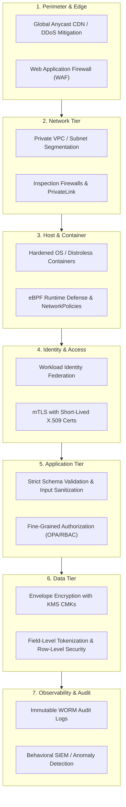

# Defense-in-Depth Architecture

## Executive Summary

Defense-in-depth is the architectural discipline of deploying multiple, redundant, and independent security controls across every layer of the technology stack. The primary premise is that **any individual control will eventually fail, be misconfigured, or be bypassed**. 

A resilient architecture ensures that a failure in one layer (e.g., a WAF bypass) is stopped by the next layer (e.g., strict API input validation, least-privilege IAM, or database encryption).

---

## 1. The 7 Concentric Defense Rings

---

## 2. Layer-by-Layer Architectural Controls

| Layer | Threat Mitigated | Defensive Controls | Failure Mode if Control Fails |
| :--- | :--- | :--- | :--- |
| **1. Edge / Perimeter** | Volumetric DDoS, common bot scanning, OWASP Top 10 web exploits | Cloudflare/Cloud Armor DDoS mitigation, AWS WAF rate-limiting rules, geo-blocking | Upstream compute services saturated; direct application exposure |
| **2. Network** | Unauthorized lateral traversal, network sniffing, open port probing | Private subnets with zero public IPs, Transit Gateway with centralized egress inspection, NACLs | Attacker on one host can directly scan and connect to other internal hosts |
| **3. Host / Compute** | Kernel exploits, privilege escalation, root compromises | Distroless container images, read-only root filesystems, Linux capabilities dropped (`drop: ALL`), seccomp profiles | Compromised container gains root access on underlying worker node VM |
| **4. Identity** | Stolen credentials, man-in-the-middle (MitM) token replay | Mutual TLS (mTLS) with Istio/Linkerd, Workload Identity Federation (no static keys), short token TTLs | Adversary with network tap can capture cleartext credentials or tokens |
| **5. Application** | SQL injection, SSRF, broken object-level authorization (BOLA) | Parameterized queries, strict JSON schema validation, externalized policy engine (Open Policy Agent) | Arbitrary code execution or unauthorized access to other tenants' data |
| **6. Data** | Physical disk theft, unauthorized database dumps, insider threat | AES-256-GCM envelope encryption, database Transparent Data Encryption (TDE), column-level tokenization of PII | Raw database export yields cleartext credit cards or passwords |
| **7. Audit & Forensics**| Covert tampering, undetected persistence, log tampering | Streaming logs to immutable S3 Object Lock (WORM), centralized SIEM alerting on privilege changes | Attacker clears event logs on local VM to hide breach trajectory |

---

## 3. Practical Architecture Scenario: Layered Defense against SQL Injection

Consider an attacker attempting a blind SQL injection against an e-commerce order lookup API:
1. **Layer 1 (WAF)**: Inspects incoming HTTP payloads; detects SQL keywords in query params and blocks the request at the edge.
2. *If WAF is bypassed via novel obfuscation:*
3. **Layer 5 (Application)**: Strongly typed request binding rejects malformed characters; ORM/parameterized queries ensure SQL characters are treated as literal strings, preventing execution.
4. *If developer used raw string concatenation and the injection succeeds:*
5. **Layer 4/6 (Database IAM & Least Privilege)**: The application database user has only `SELECT` permissions on the `orders` table; cannot access `users`, `credentials`, or execute administrative procedures (`xp_cmdshell`).
6. **Layer 6 (Data Encryption)**: Sensitive fields like stored billing tokens are cryptographically tokenized; even a successful table dump yields only non-reversible ciphertext hashes.
7. **Layer 7 (SIEM & Detection)**: Database anomaly detection detects a sudden spike in query latency and row scans; automatically revokes the connection pool and alerts the SOC.
