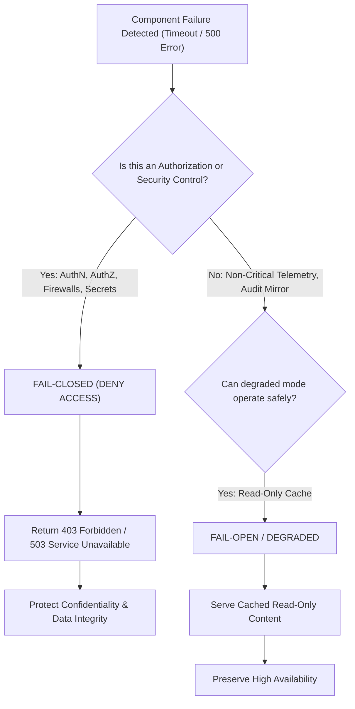

# Fail Securely Architecture (Fail-Closed vs Fail-Open)

## Executive Summary

When a security control, authentication service, authorization policy engine, or network firewall experiences a fatal exception, resource starvation, or network partition, the architecture must have a deterministic policy: **Fail-Closed (Secure)** or **Fail-Open (Permissive)**.

Choosing between Fail-Closed and Fail-Open is one of the most critical architectural decisions balancing **Security vs Availability**.

---

## 1. Decision Rubric: Fail-Closed vs Fail-Open

---

## 2. Architectural Comparison Matrix

| Subsystem | Failure Scenario | Fail-Closed Behavior | Fail-Open Behavior | Enterprise Architecture Standard |
| :--- | :--- | :--- | :--- | :--- |
| **Authorization Policy Engine (OPA)** | OPA sidecar crashes or runs out of memory | All API requests denied with HTTP 503 / 403 | Requests proceed uninspected | **Fail-Closed**: Access must be denied if policy cannot be evaluated. |
| **WAF / DDoS Filter** | Cloud WAF health check times out | Inbound traffic blocked | Inbound traffic routed directly to origin | **Contextual**: Fail-closed for high-security banking APIs; fail-open for public informational media sites. |
| **Data Loss Prevention (DLP)** | DLP inspection proxy crashes during file upload | File upload rejected with error | File stored without DLP scan | **Fail-Closed**: File must be rejected or quarantined in an unreadable bucket. |
| **Token Introspection Endpoint** | Remote OAuth introspection endpoint unreachable | Token rejected as invalid | Token assumed valid | **Fail-Closed**: Never grant access on unverified cryptographic claims. |
| **Distributed Tracing / Telemetry** | Log collector buffer overflows | Application threads block | Telemetry dropped; transactions continue | **Fail-Open**: Telemetry buffer overflows must drop telemetry, not crash payment transactions. |
