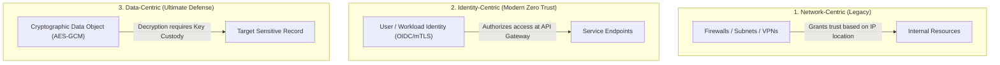

# Identity-Centric vs Data-Centric Security

## Executive Summary

Enterprise security architecture has evolved through three distinct paradigms: **Network-Centric**, **Identity-Centric**, and **Data-Centric**. A robust architecture does not choose between Identity and Data; it integrates both into a complementary defense model.

---

## 1. Comparative Architecture Paradigms

---

## 2. Architectural Comparison Matrix

| Evaluation Dimension | Identity-Centric Security | Data-Centric Security |
| :--- | :--- | :--- |
| **Primary Mechanism** | OAuth 2.0, OIDC, JWT, SAML, mTLS, Workload Identity | Envelope encryption, tokenization, hashing, row-level security |
| **Enforcement Point** | API Gateways, Service Mesh sidecars, Cloud IAM, IDPs | Cryptographic libraries, KMS, HSMs, Database engines |
| **Vulnerability to Bypass**| If identity token is compromised, attacker accesses data | Even if identity is compromised, key access policies can restrict decryption |
| **Performance Overhead** | Low (Cached JWT validation / mTLS handshake) | Moderate (Cryptographic operations, KMS network latency) |
| **Ideal Use Case** | Controlling access to microservice APIs and cloud compute | Protecting sensitive financial ledgers, healthcare records, PII |
