# Principle of Least Privilege (PoLP)

## Executive Summary

The Principle of Least Privilege dictates that any entity (human user, machine process, container, or cloud service) must possess only the bare minimum set of permissions necessary to perform its intended business function, and only for the exact duration required.

In modern distributed enterprise architectures, PoLP must be enforced programmatically across three primary dimensions:
1. **Breadth**: Restricting actions to specific API operations (e.g., `s3:GetObject`, never `s3:*`).
2. **Depth**: Restricting actions to specific resource ARNs (e.g., `arn:aws:s3:::app-bucket/tenant-123/*`, never `*`).
3. **Time**: Restricting validity to short-lived sessions via Just-in-Time (JIT) elevation and ephemeral tokens.

---

## 1. Architectural Model: Static vs Dynamic Least Privilege

```mermaid
flowchart TD
    subgraph AntiPattern ["Anti-Pattern: Static Standing Privilege"]
        U1["Developer / Workload"] -->|Has Permanent Role| R1["Administrator / Write-All"]
        R1 -->|Unchecked Access 24/7| DB1[("Production Database")]
    end
    subgraph BestPractice ["Architecture Pattern: Ephemeral Just-in-Time (JIT)"]
        U2["Workload Pod / SRE"] -->|Requests Access| EP["IdP / OIDC Provider"]
        EP -->|Evaluates Context & Ticket| PDP["Policy Engine (OPA)"]
        PDP -->|Grants 15-Minute Token| STS["Security Token Service"]
        STS -->|Scoped Ephemeral Credentials| DB2[("Production Database")]
    end
```

---

## 2. Least Privilege Across Architecture Layers

### A. Infrastructure as Code (IaC) & Cloud IAM
- **Zero Wildcard Permissions**: Ban `Action: "*"` and `Resource: "*"` in all IAM policy documents.
- **Condition-Based Guardrails**: Enforce conditions such as `aws:PrincipalArn`, `aws:SourceVpc`, and `aws:SecureTransport: true`.
- **Permission Boundaries**: Set maximum allowable permissions at the cloud account root, preventing developers from creating sub-roles that escalate privileges.

### B. Container & Kubernetes Workload Identity
- **Drop Linux Capabilities**: Drop all default capabilities in pod specs (`drop: ["ALL"]`) and add back only specific requirements (e.g., `NET_BIND_SERVICE`).
- **Read-Only Root Filesystem**: Configure `readOnlyRootFilesystem: true` to prevent attackers from downloading and executing backdoors.
- **Service Account Isolation**: Dedicated Kubernetes `ServiceAccount` per microservice; never share the `default` service account.

### C. Database Connection Pools
- Separate connection pools for Read vs Write operations:
  - **Read Pool**: Uses a database role with only `SELECT` grants on specific views.
  - **Write Pool**: Uses a database role with `INSERT` and `UPDATE` grants; zero `DROP`, `ALTER`, or `TRUNCATE` permissions.
  - **Schema Migrations**: Executed by a dedicated CI/CD pipeline role that runs exclusively during planned maintenance windows and is revoked immediately afterward.
