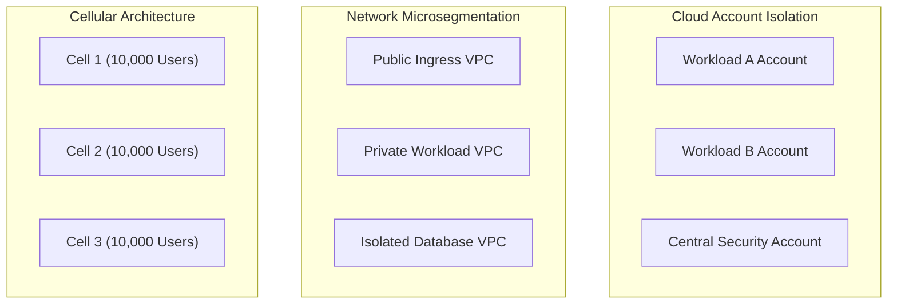

# Minimizing Blast Radius Architecture

## Executive Summary

Minimizing blast radius is the architectural practice of structuring infrastructure, networking, identity, and data domains into decoupled cells and compartments such that the compromise of a single component cannot propagate to the wider enterprise.

---

## 1. Blast Radius Containment Dimensions

---

## 2. Containment Strategies

1. **Cloud Multi-Account Strategy**:
   - Separate AWS Accounts / Azure Subscriptions for Production, Staging, Development, Security Tooling, and Central Logging.
   - If a developer's AWS access key in Staging is compromised, the attacker has zero access to Production data.

2. **Cell-Based Architecture**:
   - High-scale platforms are partitioned into self-contained operational "cells" (e.g., each serving 5% of active users).
   - If a malicious payload or catastrophic bug crashes Cell 4, 95% of users remain completely unaffected.

3. **Cryptographic Tenant Isolation**:
   - In multi-tenant SaaS, encrypt each tenant's database rows or S3 objects with an individual, dedicated KMS key.
   - Even if an attacker achieves arbitrary file read or SQL injection in the application, they cannot decrypt other tenants' data without their respective KMS keys.
