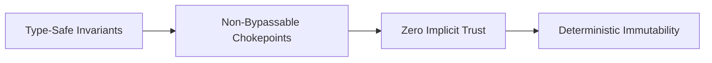

# Secure by Design Architecture

## Executive Summary

**Secure by Design** means establishing structural, mathematical, and invariant security guarantees directly within the system's architecture, making entire classes of security vulnerabilities impossible by construction rather than relying on developers to remember secure coding rules.

---

## 1. Architectural Tenets of Secure by Design

### 1. Memory Safety by Construction
- Transition from languages prone to memory corruption (C/C++) to memory-safe languages (Rust, Go, C#, Java) for networking, cryptography, and service layers, eliminating buffer overflows and use-after-free vulnerabilities.

### 2. Elimination of SQL Injection via Compile-Time Types
- Prohibit string concatenation in data access layers. Enforce compile-time type-safe query builders (e.g., EF Core, JOOQ, sqlx) where SQL injection is syntactically invalid.

### 3. Non-Bypassable Architectural Chokepoints
- Never rely on downstream services to enforce authorization. Place all inbound traffic through an architectural chokepoint (API Gateway / Service Mesh sidecar) that enforces token verification, rate-limiting, and mutual TLS before any application logic executes.

---

## 2. Invariant Design Table

| Vulnerability Class | Traditional (Vulnerable) Approach | Secure by Design Architectural Invariant |
| :--- | :--- | :--- |
| **SQL Injection** | Relying on developer to use prepared statements | Architectural ORM abstraction that prevents raw string concatenation at compile time |
| **BOLA / IDOR** | Endpoint queries DB by raw ID: `SELECT * FROM orders WHERE id = :id` | Invariant tenant context injected from token: `WHERE id = :id AND tenant_id = :ctx_tenant_id` |
| **Path Traversal** | Sanitizing filename strings via regex | Storing files in Object Storage (S3) by UUID key; zero direct filesystem path manipulation |
| **XSS** | Manual output escaping in HTML templates | Context-aware templating engines that automatically encode variables, paired with strict CSP |
| **CSRF** | Checking origin headers or custom tokens manually | Adopting stateless token-based authentication (Authorization Bearer) or `SameSite=Strict` cookies |
| **SSRF** | Blacklisting private IP ranges via regex | Network-level egress proxy that blocks all private RFC 1918 CIDR ranges; DNS rebinding protection |
