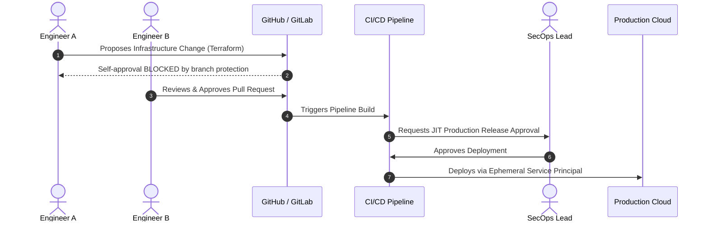

# Separation of Duties (SoD) Architecture

## Executive Summary

Separation of Duties (SoD) prevents fraud, malicious sabotage, and catastrophic human error by ensuring that critical, high-risk operational capabilities cannot be executed by a single individual working alone.

---

## 1. Architectural Four-Eyes Principle

---

## 2. Enforced Architectural Separation Boundaries

| Role Boundary | Permitted Actions | Strictly Prohibited Actions | Architectural Enforcement Mechanism |
| :--- | :--- | :--- | :--- |
| **Software Developers** | Author code, run unit tests, deploy to dev/sandbox | Approve own PRs, access production databases, deploy directly to production | GitHub branch protection rules; zero production IAM credentials issued |
| **Cloud SRE / Ops** | Manage cloud infrastructure, monitor SLOs, triage incidents | Modify application business logic, decrypt sensitive customer PII | Dedicated IaC pipelines; KMS key policies deny access to SRE roles |
| **Security Auditors** | Inspect audit logs, review compliance evidence, view CSPM | Modify security policies, disable logging, deploy infrastructure | Read-only IAM roles; WORM storage prevents log modification |
| **Database Administrators**| Optimize query execution plans, manage indexes, backups | View cleartext credit card numbers or decryption keys | Column-level encryption with keys held in KMS inaccessible to DBA |
