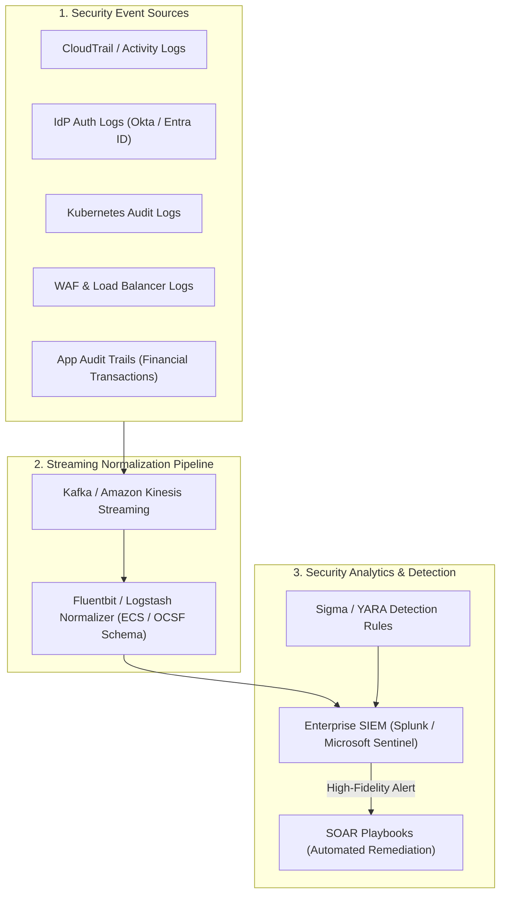

# Security Monitoring Architecture & Telemetry Pipeline

## Executive Summary

```mermaid
flowchart TD
    subgraph Sources ["1. Security Event Sources"]
        S1["CloudTrail / Activity Logs"]
        S2["IdP Auth Logs (Okta / Entra ID)"]
        S3["Kubernetes Audit Logs"]
        S4["WAF & Load Balancer Logs"]
        S5["App Audit Trails (Financial Transactions)"]
    end

    subgraph Pipeline ["2. Streaming Normalization Pipeline"]
        Kinesis["Kafka / Amazon Kinesis Streaming"]
        Logstash["Fluentbit / Logstash Normalizer (ECS / OCSF Schema)"]
    end

    subgraph SIEM ["3. Security Analytics & Detection"]
        SIEM_Engine["Enterprise SIEM (Splunk / Microsoft Sentinel)"]
        Rules["Sigma / YARA Detection Rules"]
        SOAR["SOAR Playbooks (Automated Remediation)"]
    end

    Sources --> Kinesis --> Logstash --> SIEM_Engine
    Rules --> SIEM_Engine
    SIEM_Engine -->|High-Fidelity Alert| SOAR
```
