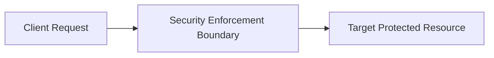

# Security Pattern: API Gateway Security Chokepoint Pattern

## 1. Problem Statement
Direct microservice exposure results in inconsistent authentication, missing rate limits, and wide attack surfaces.

## 2. Context & Applicability
Publicly exposed enterprise digital platforms serving web, mobile, and third-party API clients.

## 3. Threat Model (STRIDE)
- **Primary Threats Addressed**: DDoS, credential stuffing, BOLA/IDOR, unauthenticated endpoint exposure, shadow APIs.

## 4. Architectural Solution

A centralized API gateway acts as a non-bypassable ingress chokepoint terminating TLS, evaluating WAF rules, enforcing rate limits, and translating tokens.

## 5. Security Controls & Guardrails
- Distributed sliding-window rate limiting (Redis), strict JSON schema validation, JWT verification.

## 6. When to Use
- Multi-client architectures with shared authentication and rate-limiting requirements.

## 7. When NOT to Use
- Ultra-low latency internal inter-process communication within a single local node.

## 8. Architectural Trade-offs & Analysis
- Unified security posture vs single point of failure and potential gateway latency bottleneck.

## 9. Failure Modes & Degradation Paths
- Gateway memory saturation or Redis rate-limit outage; fail-closed policy blocks legitimate traffic.

## 10. Operational Considerations & Monitoring
- Deploy multi-AZ autoscaling gateway fleets with local in-memory fallback rate-limiting.

## 11. Evolutionary Architecture & Future Trends
- Federated API Gateways using GraphQL Mesh or Envoy Gateway API.
