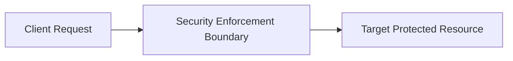

# Security Pattern: Backend-for-Frontend (BFF) Security Pattern

## 1. Problem Statement
Storing raw OAuth access and refresh tokens in browser LocalStorage exposes them to theft via XSS.

## 2. Context & Applicability
Single Page Applications (React/Angular) calling distributed microservice APIs.

## 3. Threat Model (STRIDE)
- **Primary Threats Addressed**: Cross-Site Scripting (XSS) token exfiltration, token replay, CSRF.

## 4. Architectural Solution

A dedicated backend proxy (BFF) handles the OAuth 2.0 Authorization Code flow with PKCE, maintains an encrypted HttpOnly session cookie with the browser, and injects bearer JWTs into backend microservice requests.

## 5. Security Controls & Guardrails
- HttpOnly, Secure, SameSite=Strict cookies; anti-CSRF token verification; token exchange.

## 6. When to Use
- Enterprise web applications handling sensitive customer data or financial transactions.

## 7. When NOT to Use
- Pure mobile native applications that can store tokens securely in hardware enclaves.

## 8. Architectural Trade-offs & Analysis
- Complete immunity to JavaScript token theft vs maintaining stateful/session-aware BFF server nodes.

## 9. Failure Modes & Degradation Paths
- BFF session store (Redis) failure causes global user logout.

## 10. Operational Considerations & Monitoring
- Scale Redis cluster with Multi-AZ replication; implement short-lived encrypted stateless cookies.

## 11. Evolutionary Architecture & Future Trends
- Moving BFF functionality to Cloudflare Workers / Fastly Edge Compute.
