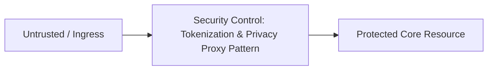

# Security Pattern: Tokenization & Privacy Proxy Pattern

## 1. Problem Statement
Securing enterprise distributed platforms requires structured architectural patterns to prevent systemic failure and compromise.

## 2. Context & Applicability
Production enterprise systems processing sensitive data, financial transactions, or multi-tenant workloads.

## 3. Threat Model (STRIDE)
- **Threats Mitigated**: PCI-DSS cardholder data exposure

## 4. Architectural Solution

Format-preserving token vault proxy

## 5. Security Controls & Guardrails
- Strict cryptographic validation and non-bypassable enforcement chokepoints.
- Automated audit logging and continuous health telemetry.

## 6. When to Use
- Mandatory across all enterprise Tier-1 and Tier-2 systems.

## 7. When NOT to Use
- Disposable prototypes or local offline developer sandboxes.

## 8. Architectural Trade-offs
- Security rigor and compliance assurance vs nominal CPU and latency overhead.

## 9. Failure Modes & Recovery
- Fail-closed behavior protecting data confidentiality; circuit breakers preventing cascading failure.

## 10. Operational Monitoring
- Real-time SIEM alerts on verification failures or elevated error rates.

## 11. Evolutionary Architecture
- Migration to post-quantum cryptographic primitives and zero-overhead eBPF integration.
