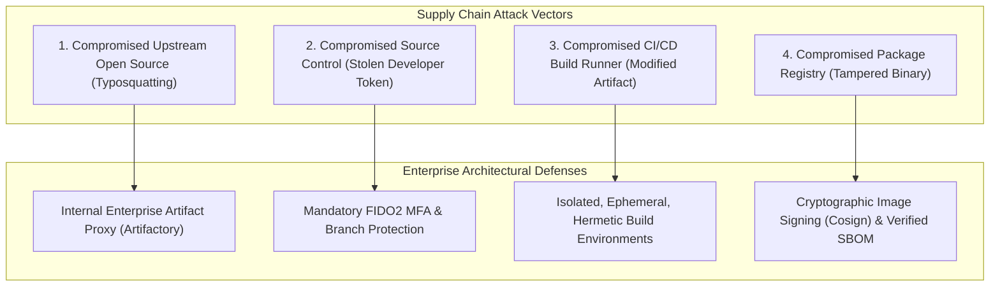

# Software Supply Chain Architecture & Defenses

## Executive Summary

```mermaid
flowchart TD
    subgraph Vectors ["Supply Chain Attack Vectors"]
        V1["1. Compromised Upstream Open Source (Typosquatting)"]
        V2["2. Compromised Source Control (Stolen Developer Token)"]
        V3["3. Compromised CI/CD Build Runner (Modified Artifact)"]
        V4["4. Compromised Package Registry (Tampered Binary)"]
    end
    subgraph Defenses ["Enterprise Architectural Defenses"]
        D1["Internal Enterprise Artifact Proxy (Artifactory)"]
        D2["Mandatory FIDO2 MFA & Branch Protection"]
        D3["Isolated, Ephemeral, Hermetic Build Environments"]
        D4["Cryptographic Image Signing (Cosign) & Verified SBOM"]
    end
    V1 --> D1
    V2 --> D2
    V3 --> D3
    V4 --> D4
```
