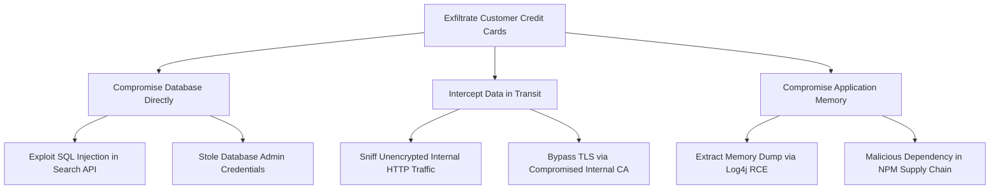

# Threat Modeling Methodologies (STRIDE, PASTA, Attack Trees)

## Executive Summary

Evaluating which threat modeling methodology to adopt depends on the system context, regulatory exposure, and architectural maturity.

---

## 1. The STRIDE Model

| Letter | Threat Category | Security Property Violated | Example Attack | Architectural Mitigation |
| :--- | :--- | :--- | :--- | :--- |
| **S** | **Spoofing** | Authenticity | Adversary replays stolen JWT or forged API key | Mutual TLS (mTLS), FIDO2 MFA, asymmetric token signing |
| **T** | **Tampering** | Integrity | Adversary alters payment amount in Transit or DB | TLS 1.3, HMAC signatures, database row signing |
| **R** | **Repudiation** | Non-Repudiation | User denies authorizing a wire transfer | Cryptographic audit logs, WORM storage, digital signatures |
| **I** | **Information Disclosure** | Confidentiality | Adversary accesses unencrypted customer PII | AES-256 envelope encryption, tokenization, strict IAM |
| **D** | **Denial of Service** | Availability | Adversary floods login API with requests | Edge Anycast CDN, rate limiting, connection pooling, backpressure |
| **E** | **Elevation of Privilege**| Authorization | Regular user calls admin API endpoint | Server-side RBAC/ABAC verification, OPA policy enforcement |

---

## 2. Attack Trees
Attack trees provide a formal, hierarchical diagrammatic method of evaluating how an adversary can achieve a specific malicious objective:

